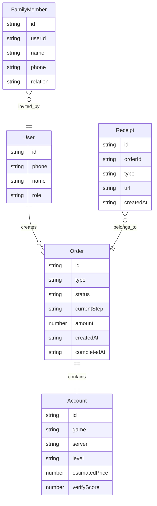

## 1. 架构设计

```mermaid
flowchart TB
    subgraph "前端层 (React + TypeScript)"
        "首页" --- "安心卖号" --- "安心买号" --- "订单进度" --- "客服帮助"
    end
    subgraph "状态管理层 (Zustand)"
        "交易状态Store" --- "用户状态Store" --- "UI状态Store"
    end
    subgraph "数据层 (Mock Data)"
        "账号数据" --- "订单数据" --- "术语数据" --- "骗局数据"
    end
    "前端层" --> "状态管理层"
    "状态管理层" --> "数据层"
```

## 2. 技术说明

- **前端框架**：React@18 + TypeScript + Vite
- **样式方案**：Tailwind CSS@3（适老化自定义主题）
- **路由方案**：react-router-dom@6（底部Tab导航）
- **状态管理**：Zustand（轻量级，管理交易流程和用户状态）
- **图标库**：lucide-react（粗线条图标，适合适老化）
- **后端**：无（纯前端演示，使用Mock数据）
- **数据存储**：localStorage（本地持久化订单和凭证数据）

## 3. 路由定义

| 路由 | 用途 |
|------|------|
| / | 首页 - 流程说明、术语翻译、骗局提醒、担保说明、快捷入口 |
| /sell | 安心卖号 - 步骤式资料填写、账号估值、换绑辅助 |
| /buy | 安心买号 - 选购流程、验号结果、风险提示 |
| /orders | 订单进度 - 订单追踪、超时提醒、家属协同、凭证归档 |
| /support | 客服帮助 - 人工客服直连、电话辅助、FAQ、申诉 |

## 4. 组件架构

### 4.1 全局组件

| 组件名 | 说明 |
|--------|------|
| Layout | 底部Tab导航布局，固定标题栏+内容区+底部导航 |
| BottomNav | 5个Tab底部导航，大图标+大文字标签 |
| TermTooltip | 术语翻译弹窗组件，点击术语标签弹出"人话翻译" |
| VoicePlayer | 语音播报组件，支持播放/暂停，文字同步高亮 |
| RiskAlert | 风险提示弹窗，全屏遮罩+大字说明 |
| StepProgress | 步骤进度条组件，用于卖号/买号流程 |
| LargeButton | 适老化大按钮组件，最小48px点击区域 |
| SafetyBadge | 安全等级徽章，绿/黄/红三色 |

### 4.2 页面组件

| 页面 | 组件 | 说明 |
|------|------|------|
| 首页 | FlowGuide | 流程说明卡片组 |
| 首页 | ScamAlert | 骗局语音提醒卡片 |
| 首页 | GuaranteeExplain | 担保收款说明 |
| 安心卖号 | SellStepForm | 分步表单(4步) |
| 安心卖号 | PriceEstimate | 价格粗估仪表盘 |
| 安心买号 | AccountCard | 账号信息大卡片 |
| 安心买号 | VerifyResult | 验号结果仪表盘 |
| 订单进度 | OrderTimeline | 订单时间轴 |
| 订单进度 | TimeoutAlert | 超时节点提醒 |
| 订单进度 | FamilyShare | 家属协同分享 |
| 订单进度 | ReceiptArchive | 交易凭证归档列表 |
| 客服帮助 | ContactButtons | 一键直连大按钮组 |
| 客服帮助 | FAQAccordion | 手风琴式FAQ |

## 5. 数据模型

### 5.1 数据模型定义



## 6. 适老化设计规范

### 6.1 字体规范
- 页面标题：24px / font-bold
- 卡片标题：20px / font-semibold
- 正文内容：18px / font-normal
- 辅助说明：16px / font-normal
- 最小字号：14px（仅用于不可省略的备注）
- 行间距：1.6-1.8

### 6.2 间距规范
- 页面内边距：20px
- 卡片间距：16px
- 卡片内边距：20px
- 按钮高度：52-56px
- 输入框高度：56px
- 图标大小：24-28px

### 6.3 颜色规范
- 主色：#F97316（暖橙）
- 主色深：#EA580C
- 主色浅：#FFF7ED
- 安全绿：#22C55E
- 注意黄：#EAB308
- 风险红：#EF4444
- 文字主色：#1C1917
- 文字次色：#78716C
- 背景色：#FFF7ED
- 卡片色：#FFFFFF
- 分割线：#E7E5E4

### 6.4 交互规范
- 所有按钮点击区域≥48x48px
- 重要操作二次确认
- 危险操作（转账等）强制语音提醒
- 表单每步有"不知道怎么填？看示例"入口
- 加载状态使用骨架屏而非空白
- 错误提示使用友好语言，不显示技术错误码
